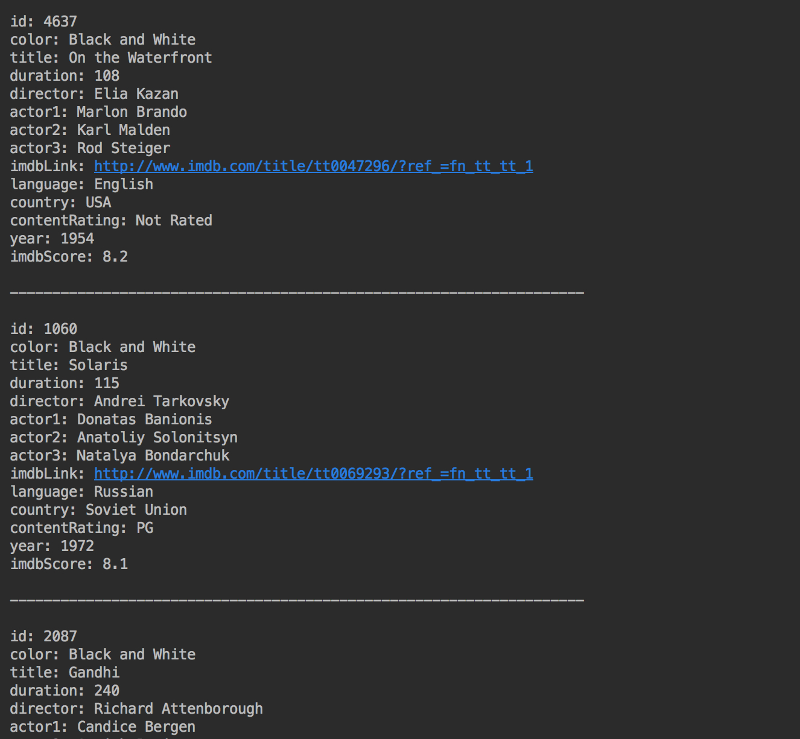

# MovieDatabaseQuery
Given a .csv file containing IMDB movie information of about 5000 movies, this program creates a movie database by reading the data in to an array. It then allows the user to add any of the following search indexes:
* year
* movie_title
* color
* duration
* director_name
* actor_name
* movie_imdb_link
* language
* country
* content_rating
* imdb_score

Each time a new search index is added, a new red-black tree is created where the key is the search index, and the value is the set of movie ids that have that search index.

The user can then generate queries by combining one or more of the following queries:
* and
* or
* not
* greater than or equal to
* less than or equal to
* greater than
* less than
* equal to
* not equal to

The query is then executed using the indexing trees and the resulting list of movies and their information is printed out.

## Sample Query and Corresponding Output

```
Query query = new And(new Equal("color", "Black and White"), new GT("imdb_score", 8.0));
```




